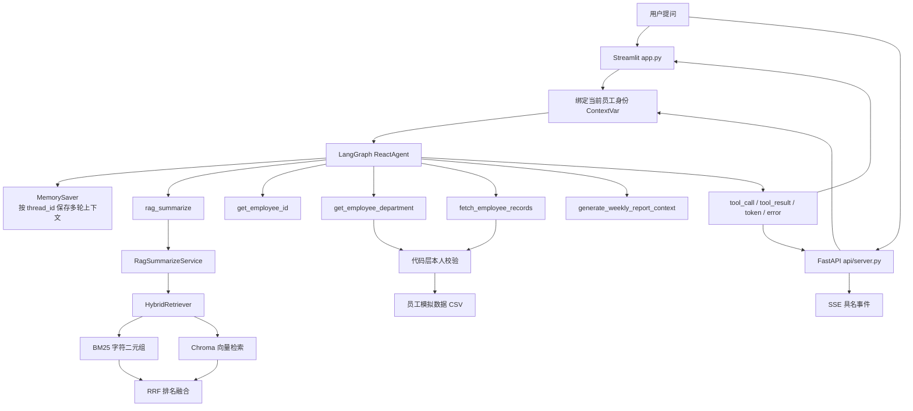

# 企业知识库 Agent 助手：AI 应用开发面试讲解

> 本文用于准备 AI 应用开发岗位面试。内容以当前仓库代码和已有评测结果为依据，目标不是重复 README，而是帮助你把项目讲清楚、把关键技术讲透，并能应对面试官的连续追问。

## 1. 项目速览

### 1.1 一句话介绍

这是一个面向企业内部场景的知识库 Agent：使用 LangGraph 编排工具调用，通过混合检索 RAG 回答制度问题，并在代码层实施员工数据权限校验，同时提供 Streamlit 演示界面、FastAPI + SSE 服务接口和可复现的离线评测体系。

### 1.2 30 秒面试版

> 我做了一个企业知识库 Agent，主要解决两类问题：一类是请假、报销、IT 支持等公共制度问答，另一类是年假余额、项目记录和周报等个人业务查询。系统使用 LangGraph 的原生工具调用完成任务编排，RAG 部分采用本地 BGE Embedding、Chroma、BM25 和 RRF 混合检索。个人数据访问不是依赖提示词，而是在工具层通过 ContextVar 绑定当前身份并执行越权校验。项目还提供了 FastAPI + SSE 流式接口，以及一套包含检索指标、LLM-as-judge 和分块粒度扫描的评测体系。

### 1.3 2 分钟面试版

> 这个项目的背景是企业内部问答通常同时包含公共知识和个人业务数据。公共制度适合走 RAG，但个人数据不能直接放进向量库，也不能只靠提示词限制访问，所以我把系统设计成了一个工具调用 Agent。
>
> 用户请求进入系统后，入口先绑定当前员工身份。LangGraph Agent 再根据问题选择工具：制度问题调用 `rag_summarize`，个人问题先获取当前员工 ID，再调用员工数据工具；生成周报时则组合部门、项目和周报上下文等多个工具。工具参数使用 JSON Schema 和枚举约束，比传统文本 ReAct 中解析 `Action` 字符串更稳定。
>
> RAG 侧我没有只做向量检索，而是将 BM25 和向量召回通过 RRF 做排名融合。为了避免凭经验选分块大小，我扫描了 7 个 `chunk_size`。结果显示分块从 200 调到 100 后，纯向量的 Hit@1 从 0.880 提升到 1.000，Precision@3 从 0.587 提升到 0.760。最终选择 100 的主要原因不是指标碰巧最高，而是它与 6 篇制度文档的 30 个语义小节刚好对齐。
>
> 工程上我还处理了并发身份隔离、SSE 流式输出、首字延迟监控、引用来源一致性、向量库与 MD5 入库台账失配自愈等问题。当前检索层结果可本地复现，生成层评测代码已经具备，但真实模型结果尚未运行，因此我不会把未验证的生成指标当作项目成果。

## 2. 业务问题与设计目标

### 2.1 目标场景

系统覆盖以下企业内部场景：

- 公共制度问答：请假、报销、入职、信息安全、IT 支持、项目协作。
- 个人业务查询：年假余额、报销状态、参与项目、入职待办。
- 内容生成：根据员工模拟业务数据生成结构化周报。
- 多入口接入：既能通过 Streamlit 演示，也能通过 HTTP 接口接入 OA、IM 机器人或内部搜索框。

### 2.2 核心问题

这个项目不是简单的“文档问答”，而是同时处理四类工程问题：

1. **知识获取**：如何从制度文档中召回真正相关的内容。
2. **任务编排**：如何让模型根据问题自动决定调用哪个工具、按什么顺序调用。
3. **数据安全**：如何保证员工只能查询自己的个人数据。
4. **工程交付**：如何流式输出、隔离会话、记录指标、暴露服务接口并持续评测。

### 2.3 明确的非目标

- 当前数据全部是模拟数据，没有连接真实 HR、财务或 OA 系统。
- `employee_id` 由客户端提交，属于模拟登录，不是真实认证。
- 当前知识库只有 6 篇文档，结论不能直接外推到大规模企业知识库。
- 生成层真实评测尚未完成，不能宣称 Faithfulness 或 Answer Relevancy 已达到某个数值。

## 3. 技术栈

| 层次 | 技术 | 在项目中的作用 |
|---|---|---|
| Agent 编排 | LangGraph | 原生工具调用、执行循环、多轮记忆、同步与异步事件流 |
| LLM 应用抽象 | LangChain | Tool、Prompt、Runnable、Document、OutputParser 等抽象 |
| 对话模型 | DeepSeek / DashScope | 回答生成、工具选择；由模型工厂按配置装配 |
| Embedding | FastEmbed + `BAAI/bge-small-zh-v1.5` | 本地中文向量化，ONNX 推理，无需在线 API Key |
| 向量库 | Chroma | 文档向量持久化和相似度检索 |
| 词法检索 | BM25 | 补充数字、术语和精确词面匹配能力 |
| 排名融合 | RRF | 融合 BM25 与向量检索的排名 |
| Web UI | Streamlit | 对话演示、身份切换、参数调整、上传知识文件、展示工具轨迹与引用 |
| 服务层 | FastAPI + SSE | 提供异步流式 HTTP 接口 |
| 评测与测试 | pytest + 自定义评测脚本 | 检索指标、生成指标、并发隔离和安全回归测试 |
| 配置 | YAML + `.env` | 模型、检索、提示词和密钥分离 |

项目依赖使用精确版本锁定。原因是分块器、Embedding 和检索器实现的版本变化都可能改变评测结果，锁版本有助于结果复现。

## 4. 系统架构



### 4.1 模块职责

| 文件 | 主要职责 | 面试时值得强调的点 |
|---|---|---|
| `agent/react_agent.py` | 创建和缓存 LangGraph 执行图，维护记忆，翻译事件 | 工具调用、多轮记忆、同步/异步共用事件翻译、失败显式化 |
| `agent/tools/agent_tools.py` | 定义 5 个工具、绑定身份、读取员工数据、越权校验 | Tool Schema、`Literal` 枚举、ContextVar、代码层安全边界 |
| `rag/vector_store.py` | 文档切分、增量入库、检索器统一装配 | 单一装配点、MD5 台账、自愈、持久化配置陷阱 |
| `rag/hybrid_retriever.py` | BM25、向量召回、RRF 融合 | 中文字符二元组、候选集、排名融合、降级策略 |
| `rag/rag_service.py` | 检索、上下文构造、答案生成、引用来源登记 | LCEL 链、来源与实际检索结果一致、并发隔离 |
| `model/factory.py` | 按 provider 装配对话和向量模型 | 注册表、惰性加载、缓存、环境变量优先级 |
| `api/server.py` | HTTP API、SSE 编码、异步流、请求指标 | TTFT、错误事件、客户端断开日志、异步 ContextVar |
| `app.py` | Streamlit 交互和展示 | 身份切换、模型/Top-K 设置、工具轨迹、来源卡片、会话导出 |
| `eval/` | 评测集、指标、运行脚本、分块扫描 | 检索与生成分层评估，避免只看端到端主观效果 |
| `tests/` | 关键行为回归测试 | 权限、隔离、事件协议、失败可见性、入库自愈 |

## 5. 三条典型请求链路

### 5.1 公共制度问题

以“报销需要哪些材料”为例：

1. Agent 判断这是企业制度问题。
2. 调用 `rag_summarize(query)`。
3. `HybridRetriever` 分别执行 BM25 与向量召回。
4. 使用 RRF 融合两个排名，选择 Top-K 文本块。
5. `RagSummarizeService` 将问题与参考资料填入 RAG 提示词。
6. 模型严格基于参考资料生成答案。
7. 本次真正检索到的文档块通过 ContextVar 登记，供 UI/API 展示引用。

关键点：引用来源不是 UI 用原问题重新检索得到的，而是生成答案时实际使用的那批文档。

### 5.2 个人数据问题

以“我的年假还剩几天”为例：

1. Streamlit 或 API 在请求开始时调用 `set_current_employee(employee_id)`。
2. Agent 先调用 `get_employee_id()` 获取当前登录身份。
3. Agent 调用 `fetch_employee_records(employee_id, "leave_balance")`。
4. 工具内部先执行 `_deny_if_not_self()`。
5. 只有参数中的员工 ID 与当前身份一致时，工具才读取并返回数据。

关键点：权限控制发生在数据工具内部，不依赖模型是否遵守提示词。

### 5.3 周报生成

周报属于多工具协作场景。提示词要求 Agent 依次获取：

1. 当前员工 ID；
2. 员工所属部门；
3. 周报写作要求；
4. 员工本周项目、产出、风险和下周计划；
5. 最后生成固定结构的周报。

这个场景体现了 Agent 的价值：步骤需要根据上下文动态组织，但具体数据访问仍然由确定性的工具承担。

## 6. Agent 与 Tool Calling

### 6.1 什么是 ReAct

ReAct 可以概括为“推理—行动—观察”的循环：

1. 模型根据目标判断下一步动作；
2. 调用外部工具；
3. 获取工具返回的观察结果；
4. 决定继续调用工具还是生成最终答案。

传统文本 ReAct 常要求模型输出：

```text
Thought: 我需要查询知识库
Action: rag_summarize
Action Input: 年假计算规则
```

这种方式依赖字符串格式。少一个冒号、多一段解释或参数格式不符合预期，都可能导致解析失败。

### 6.2 为什么改用原生工具调用

当前项目使用 LangGraph `create_react_agent` 和模型原生 Tool Calling：

- 工具名称与参数通过结构化数据传递，不再解析自由文本。
- `fetch_employee_records.query_type` 使用 `Literal[...]`，非法值会在执行前被 Schema 拒绝。
- 工具可以有多个独立字段，不需要自己切分逗号或清理引号。
- 前端可以直接得到 `tool_call` 和 `tool_result` 事件。

面试表达：

> 我保留了 ReAct 的循环思想，但把行动协议从脆弱的文本格式升级成了模型原生工具调用。这样减少了 Parser Error，也让参数约束成为接口契约。

### 6.3 Agent 不是所有问题的答案

适合使用 Agent 的情况：

- 用户意图不固定，需要动态选择工具；
- 工具调用顺序与问题内容相关；
- 支持多轮追问；
- 需要组合公共知识和个人数据。

不适合使用 Agent 的情况：

- 流程完全固定、强审计、一步不能错；
- 对延迟和成本极度敏感；
- 业务规则能够由普通代码明确表达。

生产中可以采用“Agent 负责决策，确定性代码负责执行与安全”的边界。

## 7. LangGraph 编排与记忆

### 7.1 执行图

`ReactAgent` 惰性调用 `_get_graph()` 创建执行图，并注入：

- 当前聊天模型；
- 5 个工具；
- 系统提示词；
- `MemorySaver` Checkpointer。

执行图会缓存。若界面切换模型，代码比较模型对象并重建图，避免 UI 已显示新模型但底层仍使用旧模型。

### 7.2 多轮记忆

记忆以 `thread_id` 为隔离维度：

- 相同 `thread_id`：可以理解“那病假呢？”等省略上下文的追问；
- 不同 `thread_id`：历史互不干扰；
- 清空会话：删除当前线程记忆，并生成新的线程 ID。

`MemorySaver` 的局限是只保存在进程内存中，服务重启后丢失。生产环境可以替换成 SQLite 或 PostgreSQL Checkpointer，并增加 TTL、用户归属校验和历史压缩。

### 7.3 为什么身份切换必须同时清空记忆

如果用户 A 查询过自己的年假，随后界面切换到用户 B，但仍保留原对话历史，B 追问“刚才那个还有几天”，模型可能直接从历史中复述 A 的数据，整个过程不再调用工具，工具层权限校验也就没有机会拦截。

因此身份切换不仅要更新 ContextVar，还必须清空可见消息和 Agent 记忆。这说明安全边界不仅存在于数据访问层，也存在于会话生命周期管理中。

## 8. RAG 全链路

### 8.1 RAG 的基本结构

RAG，即 Retrieval-Augmented Generation，核心流程是：

```text
原始文档 → 加载 → 分块 → Embedding → 向量库
用户问题 → 检索 → Top-K 上下文 → Prompt → LLM 答案
```

它解决的是“让模型基于外部、可更新的知识回答”，而不是把所有企业知识重新训练进模型。

### 8.2 为什么需要 RAG，而不是直接把全文塞给模型

- 全文可能超过上下文窗口；
- 大量无关文本会稀释注意力；
- 每次发送全文增加 Token 成本和延迟；
- 很难清楚展示答案依据；
- 文档更新后重新训练模型成本过高。

### 8.3 分块为什么重要

分块不是简单地“每 N 个字符切一刀”。它同时影响：

- 召回率：块太小可能丢失必要上下文；
- 精确率：块太大可能混入多个主题；
- Embedding 表示：一个向量需要概括整个块，主题越杂，表示越模糊；
- Token 成本：无关内容会占用上下文；
- 答案忠实度：噪声更容易诱导模型答偏。

本项目的 6 篇制度文档都由 5 个小节组成，每节约 50～90 字。实验发现：

- `chunk_size=80` 会把部分小节从中间切断；
- `chunk_size=120` 会合并一些相邻小节；
- `chunk_size=200` 会产生同时包含不同主题的“万金油块”；
- `chunk_size=100` 恰好得到 30 个块，与 30 个语义小节逐一对齐。

因此最终选 100 的核心依据是语义结构，指标用于验证这个判断，而不是只在评测集上寻找最高分。

### 8.4 Embedding

Embedding 将文本映射为高维向量。语义相近的文本，其向量距离通常更近。项目使用 `BAAI/bge-small-zh-v1.5`：

- 面向中文语义检索；
- 通过 FastEmbed 和 ONNX 本地运行；
- 不依赖 PyTorch；
- 首次下载后可以离线使用；
- 不产生在线 Embedding 调用费用。

需要注意：更换 Embedding 模型后，旧向量库中的向量空间不再兼容，必须重新入库。

### 8.5 Chroma

Chroma 在项目中承担：

- 持久化文档向量；
- 保存文本和来源元数据；
- 根据查询向量执行近邻检索；
- 返回文档及距离分数。

项目曾遇到一个典型配置陷阱：给 Chroma 手动传入默认 `is_persistent=False` 的 Client Settings，会让 `persist_directory` 被忽略，数据只存在内存中。当前实现不再覆盖框架的持久化默认配置。

## 9. BM25、向量检索与 RRF

### 9.1 向量检索的优势和短板

优势：

- 能处理同义表达；
- 能根据语义而非完全相同的关键词匹配；
- 对自然语言问题更友好。

短板：

- 数字、编号、缩写和专有名词的精确匹配可能不稳定；
- 当文本块包含多个主题时，可能召回“什么都沾一点”的块；
- 距离分数受模型和向量库实现影响，不具备统一量纲。

### 9.2 BM25 的直觉

BM25 是经典词法检索算法。它关注：

- 查询词是否出现在文档中；
- 查询词在该文档中出现的频率；
- 该词在整个语料中是否稀有；
- 文档长度是否异常。

简化理解：某个词在当前文档经常出现、在其他文档很少出现，它对当前文档的区分能力就更强。

中文没有天然空格分词。项目没有引入 Jieba，而是去除空白后生成字符二元组，例如：

```text
“年假申请” → [“年假”, “假申”, “申请”]
```

这种方式简单、无额外词典依赖，对当前制度术语已足够，但在更复杂语料中仍可评估专业词典、中文分词器或稀疏向量模型。

### 9.3 为什么不能直接相加两种分数

BM25 分数和向量距离含义不同：

- BM25 通常越大越相关；
- Chroma 返回的距离通常越小越相关；
- 两者数值范围也不同。

直接执行 `0.5 * bm25_score + 0.5 * vector_score` 没有可靠意义，除非先设计并验证归一化方案。

### 9.4 RRF 排名融合

RRF（Reciprocal Rank Fusion）只使用排名，不直接使用原始分数：

```text
score(d) = Σ 1 / (k + rank_i(d))
```

其中：

- `rank_i(d)` 是文档 `d` 在第 `i` 个检索列表中的名次；
- `k` 是平滑常数，本项目使用 60；
- 一个文档如果在多条检索链路中都排名靠前，会得到更高融合分。

项目中每一路先取 `fetch_k=10` 个候选，再通过 RRF 融合，最后返回 Top-K。若向量检索异常，会记录错误并退化为纯 BM25，而不是让整个问答链路失败。

### 9.5 如何解释实验中的权衡

跨 7 个分块配置：

| 指标 | 混合检索更优 | 持平 | 纯向量更优 |
|---|---:|---:|---:|
| Hit@1 | 5 | 2 | 0 |
| MRR | 5 | 2 | 0 |
| Precision@3 | 1 | 1 | 5 |

合理结论是：混合检索提升了首位排序的鲁棒性，但可能牺牲一个上下文席位，因为 BM25 会把出现相同词面的其他块一并抬高。

不能得出的结论是“混合检索在任何场景都优于向量检索”。当前只有 25 道检索题，且 7 次扫描共用同一数据集，并不是 7 次独立实验。

## 10. Prompt 设计

项目将提示词拆成三类：

1. **Agent 系统提示词**：规定工具选择、个人数据访问流程和回答边界。
2. **RAG 总结提示词**：要求只依据参考资料回答，资料不足时明确拒答。
3. **周报提示词**：规定周报结构和不得编造个人业务数据。

这种分层比把所有规则塞进一个超长 Prompt 更容易维护，也更便于独立测试。

需要强调：提示词适合约束回答风格和工具使用策略，不适合承担真正的权限控制。权限必须由普通代码、认证系统和数据访问层保证。

## 11. 身份隔离与权限控制

### 11.1 为什么不用全局变量保存当前员工

Web 服务中多个请求可能并发执行。若使用模块级变量：

```python
current_employee = "E1001"
```

请求 A 写入 E1001 后，请求 B 可能立即写入 E1002，请求 A 后续读到的就可能是 E1002，产生数据串线。

项目使用 `ContextVar`：每个执行上下文拥有自己的变量值，适合协程并发下的请求级状态。

### 11.2 权限检查为什么放在工具内部

如果只在系统提示词中写“不能查询他人信息”，仍存在以下问题：

- 模型可能被 Prompt Injection 诱导；
- 模型可能因推理错误调用错误参数；
- 后续更换模型后行为可能变化；
- 无法形成稳定、可测试的安全边界。

因此 `fetch_employee_records` 和 `get_employee_department` 在读取数据前都会比较“请求参数中的员工 ID”和“当前会话身份”。不一致时直接拒绝，并以 warning 级别记录安全事件。

### 11.3 当前方案仍不等于真实鉴权

当前 API 中的员工 ID 由客户端在请求体中声明，服务端只验证该 ID 是否存在。因此用户仍然可以伪造另一个合法 ID 作为自己的身份。

生产改造应当是：

```text
SSO/OAuth 登录
  → 网关验证令牌
  → 从可信 Claim 获取 employee_id
  → 写入请求上下文
  → 数据访问层执行本人/角色/组织权限校验
```

同时还应加入 RBAC/ABAC、审计日志、敏感字段脱敏、数据最小化和会话归属检查。

## 12. 流式输出、异步与 SSE

### 12.1 为什么使用 SSE

当前交互是单向的：客户端提交一次问题，服务端持续推送事件，完成后结束。因此 SSE 比 WebSocket 更贴合：

- 基于普通 HTTP；
- 浏览器支持 `EventSource` 和具名事件；
- 更容易通过企业代理；
- 实现和运维复杂度较低。

如果未来需要实时语音、客户端中途发送控制消息或真正的双向协作，再考虑 WebSocket。

### 12.2 事件协议

系统统一输出以下结构化事件：

| 事件 | 含义 |
|---|---|
| `start` | 返回会话 ID |
| `tool_call` | 模型准备调用工具及其参数 |
| `tool_result` | 工具执行结果 |
| `token` | 最终回答的增量文本 |
| `sources` | 实际使用的引用来源 |
| `error` | 显式失败信息 |
| `done` | 请求结束 |

Streamlit 把工具事件放在折叠的“推理过程”中，将 Token 放入正文；FastAPI 则编码成具名 SSE 事件。

### 12.3 FastAPI 为什么必须走异步 Agent 流

如果在异步接口中直接迭代同步生成器，会阻塞事件循环。若把同步生成器交给线程池，Starlette 可能对每次取下一个元素都复制一次上下文，导致生成器开头设置的 ContextVar 在后续轮次失效。

项目使用 `astream_events()`，使整条 Agent 执行链路运行在同一个异步任务上下文中，从而同时保证：

- 不阻塞事件循环；
- 身份 ContextVar 在多轮工具调用中保持有效；
- 并发请求的身份不互相污染。

### 12.4 流式响应中的错误为什么要变成事件

HTTP 流开始后，响应头通常已经发送，服务端不能再把状态码从 200 改成 500。如果异常直接逃逸，客户端可能只看到连接结束或一个正常的 `done`，误以为系统返回了空答案。

因此项目在 Agent 和服务层分别兜底，把运行错误编码成 `error` 事件，并在汇总日志中标记为错误。

## 13. 模型工厂与惰性加载

模型工厂通过注册表支持：

- 对话模型：DeepSeek、DashScope；
- Embedding：本地 FastEmbed、DashScope；
- Judge 模型：固定低温度，用于生成层评测。

### 13.1 为什么惰性创建模型

如果在模块导入时就创建模型客户端：

- 缺少 API Key 会导致整个模块无法导入；
- 只运行本地检索评测也会被迫依赖在线模型；
- 测试收集阶段就可能失败。

当前实现只在首次访问模型时构建，并进行缓存。显式切换模型或温度时重新构建临时实例。

### 13.2 环境变量优先级

`.env` 使用固定项目路径加载，且不覆盖已有环境变量。因此优先级为：

```text
系统/容器/CI 注入的环境变量 > 本地 .env
```

这符合 12-Factor App 对配置外置化的思路。

## 14. 引用来源一致性

一个容易忽略的问题是：Agent 可能把用户问题改写成更适合检索的查询。如果 UI 使用原始问题重新检索一次，会出现：

- 重复执行 Embedding 和 BM25，增加延迟；
- UI 展示的来源与模型真正读到的来源不一致；
- 用户无法可靠验证回答依据。

项目让 `RagSummarizeService` 在业务链路中登记最后一次实际检索结果，UI 和 API 直接读取并格式化。这既减少重复计算，也维护了答案与引用之间的可追溯性。

## 15. 增量入库与台账自愈

### 15.1 MD5 台账

知识文档入库时计算文件 MD5。已存在的 MD5 会被跳过，从而避免重复向量化。

### 15.2 为什么会出现“台账说有，向量库却是空的”

MD5 台账和 Chroma 是两个独立持久化对象。若向量库被删除、替换或重建，但台账仍在，所有文件都会被判断为“已处理”，最终产生一个永远无法恢复的空知识库。

### 15.3 自愈策略

入库前检查：

```text
台账非空 AND 向量集合为空
  → 判定台账失效
  → 清空台账
  → 全量重新入库
```

这是一个典型的分布式状态一致性问题的缩小版。更完善的生产方案可以把文件版本、Embedding 模型版本、切分配置和向量集合版本记录在同一个元数据存储中，并使用可回滚的构建与切换流程。

## 16. 评测体系

### 16.1 为什么分成检索层和生成层

RAG 答错通常有两种来源：

1. 正确资料没有被检索到；
2. 资料已经检索到，但模型没有正确使用。

若只看最终答案准确率，就很难判断应该优化 Retriever 还是 Prompt/LLM。因此项目将评测拆成两层。

### 16.2 数据集

`eval/golden_set.jsonl` 共 30 题：

- 25 道检索题；
- 5 道应拒答问题；
- 覆盖 HR、财务、IT、安全、项目协作和入职等类别；
- 每题包含期望来源、参考答案和出题意图。

### 16.3 检索指标

#### Hit@K

Top-K 中只要出现至少一个期望来源就记为 1，否则为 0。

适合回答：“正确资料有没有被召回？”

局限：当 K 较大时容易饱和，无法体现正确结果排第 1 还是第 K。

#### MRR

取第一个正确结果排名的倒数，再对所有问题求平均：

```text
MRR = mean(1 / rank_first_relevant)
```

第 1 名得 1，第 2 名得 0.5，第 3 名约得 0.333。它比 Hit@K 更关注排序质量。

#### Context Recall

```text
召回的期望来源数 / 全部期望来源数
```

适用于答案需要多个来源的场景。

#### Precision@K

```text
Top-K 中相关结果数 / 实际返回结果数
```

它反映上下文纯度。即使 Hit@3 为 1，也可能只有 1 个相关块和 2 个噪声块，此时上下文仍不理想。

### 16.4 当前可复现结果

在 `chunk_size=100`、Top-K=3 下：

| 策略 | Hit@1 | Hit@3 | MRR | Context Recall | Precision@3 |
|---|---:|---:|---:|---:|---:|
| 纯向量 | 1.000 | 1.000 | 1.000 | 1.000 | 0.760 |
| BM25 + 向量 + RRF | 1.000 | 1.000 | 1.000 | 1.000 | 0.733 |

单看这一组数据，不能证明混合检索更好。更有意义的是完整粒度扫描：

| chunk | 纯向量 Hit@1 | 混合 Hit@1 | 纯向量 P@3 | 混合 P@3 |
|---:|---:|---:|---:|---:|
| 80 | 0.960 | 1.000 | 0.760 | 0.773 |
| 100 | 1.000 | 1.000 | 0.760 | 0.733 |
| 120 | 1.000 | 1.000 | 0.733 | 0.693 |
| 150 | 0.960 | 1.000 | 0.733 | 0.693 |
| 200 | 0.880 | 1.000 | 0.587 | 0.573 |
| 300 | 0.880 | 0.960 | 0.533 | 0.520 |
| 500 | 0.880 | 0.960 | 0.333 | 0.333 |

面试时应强调实验边界：

- 25 道题中 1 道题就对应 0.04，单点差异很容易落入噪声；
- 7 个配置共享同一批题，不能当作独立试验计算显著性；
- 当前可信的是方向性观察，而不是一个可泛化的绝对提升百分比。

### 16.5 生成层指标

代码已经实现 LLM-as-judge：

- **Faithfulness**：答案中的事实是否都有参考资料支持；
- **Answer Relevancy**：答案是否真正回应问题；
- **Refusal Accuracy**：越权或知识库未覆盖时是否正确拒答。

Judge 要求输出 JSON，解析逻辑能处理 Markdown 代码块和附加文本；解析失败记为 `None`，不会静默当成 0 分污染指标。

当前仓库尚未使用真实模型跑出生成层结果。面试时正确说法是“评测链路已实现，真实结果待有可用 Key 后运行”，不能虚构分数。

## 17. 测试策略

测试重点不是追求表面覆盖率，而是保护高风险行为：

### 17.1 Agent 事件与记忆

- 工具调用、工具返回和 Token 的顺序；
- 工具名称与参数是否保留；
- 错误是否转化为 `error` 事件；
- 相同线程保留历史、不同线程互相隔离；
- 切换模型后是否重建执行图；
- 身份是否能跨多轮工具调用保持。

### 17.2 权限与数据泄露

- 本人查询是否允许；
- 查询他人信息是否拒绝；
- 未绑定身份时是否拒绝；
- 拒绝响应中是否泄露目标记录字段；
- 越权尝试是否记录 warning；
- 员工目录是否只暴露 ID、姓名、部门；
- 非法 `query_type` 是否在工具执行前被拒绝。

### 17.3 API 与并发

- SSE 是否使用合法的具名事件格式；
- 文本换行是否破坏 SSE framing；
- 未知员工、空消息、超长消息是否被拒绝；
- 两个员工并发请求时身份是否串线；
- 模型构建失败是否对客户端可见；
- 失败请求是否记录为错误而不是成功。

### 17.4 入库台账

- 首次入库是否同时写入向量库和台账；
- 二次执行是否跳过未变化文件；
- 空向量库与旧台账失配时是否自动重建；
- 健康状态下是否错误清空台账；
- 自愈完成后是否真正可检索。

项目还对部分关键用例做过变异验证：暂时撤销修复，确认测试确实失败，再恢复代码。这比“测试一直是绿的”更能证明测试真正捕获了目标缺陷。

## 18. 可观测性

FastAPI 服务为每次请求汇总一行日志，包含：

- `thread_id`；
- `employee_id`；
- TTFT（Time To First Token）；
- 总耗时；
- Token chunk 数；
- 输出字符数；
- 工具调用序列；
- 错误摘要。

为什么单独记录 TTFT：对于流式应用，用户对“是否卡住”的感受主要取决于多久看到第一个字，而不是完整答案何时结束。

日志写在 `finally` 路径中，即使客户端中途断开也尽量留下请求记录。生产中还应补充 Trace ID、模型 Token 用量、各工具耗时、检索耗时、模型首包耗时、错误码、Prometheus 指标和分布式追踪。

## 19. 项目亮点如何表达

### 19.1 不只是“调用了 LangChain”

可以强调：

- 从脆弱的文本 ReAct 迁移到结构化 Tool Calling；
- 为业务工具设计强类型 Schema；
- 将同步 UI 和异步 API 统一到同一套 Agent 事件协议；
- 把模型决策与确定性安全控制分开。

### 19.2 不只是“做了 RAG”

可以强调：

- 对比纯向量与混合检索；
- 用 RRF 处理两路分数不可比问题；
- 扫描 7 个分块大小；
- 同时观察 Hit@1、MRR 和 Precision@3；
- 最终根据语义边界而非单一最高分选择配置。

### 19.3 不只是“能运行”

可以强调：

- 有检索层和生成层两级评测设计；
- 有并发身份隔离测试；
- 有错误事件和请求级可观测性；
- 有增量入库及状态失配自愈；
- 明确记录尚未验证的部分和系统边界。

## 20. 典型踩坑与解决方案

| 问题 | 根因 | 解决方案 | 可迁移经验 |
|---|---|---|---|
| 文本 ReAct 偶发解析失败 | 自由文本协议脆弱 | 使用原生 Tool Calling 和 Schema | 能结构化就不要解析自然语言协议 |
| “我的数据”每次结果不同 | 随机选择员工 ID | 入口绑定真实会话身份 | 用户身份必须来自可信上下文 |
| 并发请求可能串身份 | 使用共享全局变量 | 使用 ContextVar，并增加并发测试 | 请求级状态必须按执行上下文隔离 |
| 提示词无法可靠防越权 | 模型行为不确定 | 工具读取数据前强制校验 | 安全边界必须由确定性代码实现 |
| Top-K 调整后退化成纯向量 | UI 自己重新构造 Retriever | 建立唯一 `build_retriever` 装配点 | 生产与评测必须复用同一配置路径 |
| 引用与答案依据不一致 | UI 用原问题重复检索 | 业务链路登记实际检索文档 | 来源是接口契约，不是装饰信息 |
| 缺 API Key 时返回空答案 | 流式响应开始后异常逃逸 | 图构建放入 try，输出 error 事件 | 流式错误必须走应用层协议 |
| 向量库丢失后无法重新入库 | MD5 台账与向量库状态失配 | 检测空集合并使台账失效 | 多份持久化状态需要一致性检查 |
| 分块太大导致上下文污染 | 一个块包含多个语义主题 | 粒度扫描并对齐文档小节 | Chunk 应围绕语义单元设计 |
| 越权测试看似通过但无效 | 用单字符做泄露断言 | 使用唯一的多字符金丝雀值 | 安全测试要验证“确实能抓到坏实现” |

## 21. 当前局限与生产化路线

### 21.1 当前局限

- 数据规模小，知识库结构高度同构。
- 评测问题数量有限，缺少多跳、跨文档和大量同义改写。
- 生成层真实指标尚未产出。
- `MemorySaver` 不持久化。
- API 没有真实认证、限流、超时、重试和熔断。
- 上传文件只做扩展名和安全文件名处理，缺少内容扫描、大小限制和异步入库任务。
- Chroma 本地单机部署，不适合高可用和大规模并发。
- 个人数据来自 CSV，不是真实的数据服务或权限系统。

### 21.2 生产化优先级

#### P0：安全与正确性

- 接入 SSO/OAuth，由可信令牌提供员工身份；
- 在数据访问层实施 RBAC/ABAC；
- 增加 Prompt Injection 防护、敏感信息检测和审计；
- 设置模型、检索、工具和整个请求的超时；
- 对流式错误定义稳定的业务错误码。

#### P1：可靠性与可观测性

- 将 Checkpointer 替换成 PostgreSQL；
- 建立 Trace ID 和 OpenTelemetry 链路；
- 记录 Token、成本、TTFT、检索耗时和工具成功率；
- 加入限流、重试、熔断和降级；
- 将文档入库改成消息队列驱动的异步任务。

#### P2：检索质量

- 扩展困难评测集；
- 引入 Query Rewrite、Metadata Filter 和 Reranker；
- 针对表格、标题和 PDF 结构进行语义切分；
- 评估 Parent-Child Retrieval 或多向量检索；
- 基于线上反馈建立持续评测闭环。

#### P3：规模化

- 根据数据量评估 Milvus、Qdrant、Elasticsearch/OpenSearch 等方案；
- 文档、向量和索引版本统一管理；
- 支持多租户知识库和租户级隔离；
- 建立蓝绿索引、增量更新和回滚机制。

## 22. 高频面试问题与参考回答

### Q1：为什么这个项目要用 Agent，普通 RAG 不够吗？

普通 RAG 适合“问题—检索—生成”的单一路径，但这个项目同时有公共知识、个人数据和周报生成。模型需要根据意图选择不同工具，并可能连续调用多个工具，因此使用 Agent 做动态编排更合适。数据读取和权限控制仍由确定性代码完成，不把所有能力都交给 Agent。

### Q2：为什么选择 LangGraph？

它提供工具调用循环、状态管理、Checkpointer 和流式事件，适合实现多轮、有状态的 Agent。相比自己写 while 循环，它更容易扩展节点、持久化状态和观察执行过程。但当前流程还比较简单，LangGraph 的主要价值体现在记忆与统一事件流上。

### Q3：Tool Calling 和传统 ReAct 有什么区别？

ReAct 是推理和行动交替的思想；Tool Calling 是行动的结构化协议。传统文本 ReAct 用自由文本表达 Action，容易解析失败；原生 Tool Calling 由模型输出符合 Schema 的工具名和 JSON 参数，更稳定，也能进行参数校验。

### Q4：为什么不能只依赖 Prompt 防止越权？

Prompt 是概率性约束，可能受到模型错误或注入攻击影响。权限控制属于安全边界，必须由确定性代码在数据读取前执行。即使模型调用了错误的员工 ID，工具也会拒绝。

### Q5：ContextVar 解决了什么问题？

它把当前员工身份绑定到执行上下文，而不是共享全局变量。异步并发时，不同请求有各自的身份值，从而避免 A 请求读取到 B 的身份。它适合请求级上下文，但前提是异步调用链没有不恰当地跨线程或丢失上下文。

### Q6：为什么 FastAPI 使用异步 Agent 流？

同步生成器直接运行会阻塞事件循环；交给线程池逐项迭代又可能破坏 ContextVar 的连续性。异步流让整个请求保持在同一 Task 上，既支持并发，又保证请求身份在多轮工具调用中有效。

### Q7：为什么选择 SSE 而不是 WebSocket？

这个场景是客户端发一次问题、服务端持续返回 Token 的单向流。SSE 足够，协议更简单，也更容易通过企业代理。只有出现双向实时控制、语音等需求时，WebSocket 的额外复杂度才有价值。

### Q8：为什么采用混合检索？

向量检索擅长语义召回，BM25 擅长精确词面、数字和专有名词。二者互补。项目实验表明混合检索在不同分块设置下的 Hit@1 和 MRR 更稳定，但有时会降低 Precision@3，所以这是排序鲁棒性与上下文纯度之间的权衡。

### Q9：为什么用 RRF，不直接加权分数？

BM25 分数和向量距离不在同一个量纲，直接加权没有可靠解释。RRF 只看排名，避免复杂的归一化；同时一个结果在两路都靠前时会得到更高融合分。

### Q10：`rrf_k=60` 有什么作用？

它是 RRF 的平滑常数。值越大，相邻名次之间的分差越小，不会让第 1 名获得过强优势，中段候选也有机会参与融合。60 是常见起点，但生产中仍应通过离线评测和线上数据调优。

### Q11：为什么 `chunk_size` 选 100？

因为它与当前文档的语义小节对齐：6 篇文档共 30 个小节，切分后正好得到 30 个块。80 会切断小节，120 以上会合并主题。评测也验证了 100 在 Hit@1 和上下文纯度之间表现良好，但不能把 100 当成通用最佳值。

### Q12：为什么 Hit@3 已经 1.0 还要看其他指标？

Hit@3 只说明正确文档出现在前三名，无法区分它排第 1 还是第 3，也无法反映另外两个块是否无关。因此还需要 MRR 衡量排名、Precision@3 衡量上下文纯度。

### Q13：如何评估 RAG 的生成质量？

将检索和生成分开。检索层用 Hit@K、MRR、Recall、Precision；生成层用 Faithfulness、Answer Relevancy、Refusal Accuracy。还需要人工抽检，并分析失败究竟来自召回、上下文组织、提示词还是模型。

### Q14：LLM-as-judge 有什么问题？

Judge 也可能偏置、不稳定或偏爱某种表达；被评模型与 Judge 如果同源，还可能有自我偏好。应固定温度和评分标准，保留理由，处理解析失败，并用一部分人工标注校准。高风险场景不能只依赖自动 Judge。

### Q15：如何处理 Prompt Injection？

仅靠提示词不能根治。需要将检索内容视为不可信数据，限制可调用工具和参数，在工具层做认证授权，对敏感操作要求二次确认或审批，并记录审计日志。还可以使用内容分类、指令与数据分隔、输出过滤和红队评测。

### Q16：为什么引用不能重新检索？

Agent 可能改写过查询，重新用原问题检索会得到不同结果；同时还浪费一次检索。应记录生成时实际使用的上下文，使引用和答案依据一致。

### Q17：如何降低延迟？

可以并行独立工具、缓存 Embedding 和热点检索、减少无关上下文、选择更快模型、使用流式输出、预热模型与索引、记录各阶段耗时并针对瓶颈优化。TTFT 和总耗时需要分开观察。

### Q18：向量库为空但台账存在为什么危险？

因为增量入库会认为所有文件已经处理并全部跳过，系统表面正常但没有任何可检索内容。这是一种静默失败，所以项目在入库前检查两者一致性，并在明确失配时重建。

### Q19：如果知识库扩大到百万级文档怎么办？

需要重新评估向量数据库、索引策略、分片、多租户隔离和增量更新；BM25 索引也不能每次进程启动从全部文本内存重建。可以采用 Elasticsearch/OpenSearch 与向量库的服务化检索，再增加 Metadata Filter、Reranker、缓存和离线索引流水线。

### Q20：这个项目最有价值的工程决策是什么？

可以选择两个角度回答：质量上，是用评测和语义边界指导分块，而不是凭经验调参；安全上，是将权限从提示词下沉到代码层，并用并发和金丝雀数据测试验证。这两点体现了从 Demo 到工程系统的思考。

## 23. STAR 项目叙述模板

### Situation

企业内部问答既包含制度文档，也包含员工个人数据。传统 FAQ 难以处理自然语言和多轮追问，简单 RAG 又无法安全访问结构化个人信息。

### Task

构建一个可演示、可服务化、可评测的企业知识助手，在保证个人数据访问边界的前提下支持制度问答、个人查询和周报生成。

### Action

- 使用 LangGraph Tool Calling 统一编排 5 个业务工具；
- 使用本地 BGE Embedding、Chroma、BM25 和 RRF 实现混合检索；
- 扫描 7 个分块粒度，并将分块边界对齐文档语义结构；
- 使用 ContextVar 绑定请求身份，在工具层阻止越权读取；
- 使用 FastAPI + SSE 提供异步流式服务；
- 建立检索指标、生成层 Judge 和关键安全回归测试。

### Result

- 在当前 25 道检索题上，`chunk_size=100` 时纯向量和混合检索的 Hit@1、Hit@3、MRR 均为 1.000；
- 纯向量 Precision@3 为 0.760，混合检索为 0.733；
- 相比 `chunk_size=200` 的纯向量配置，100 将 Hit@1 从 0.880 提升到 1.000，Precision@3 从 0.587 提升到 0.760；
- 形成 Streamlit 和 FastAPI 两种入口共用的 Agent 与工具层；
- 建立权限、并发、事件协议和入库自愈的自动化测试。

注意：Result 只陈述已有数据。生成层尚无真实模型结果，不应包装成已经完成的量化成果。

## 24. 简历描述模板

### 精简版

**企业知识库 Agent 助手｜Python、LangGraph、RAG、Chroma、FastAPI**

- 基于 LangGraph Tool Calling 构建企业知识 Agent，支持制度问答、员工个人数据查询、周报生成和多轮会话。
- 实现 BGE + Chroma 向量检索与 BM25 + RRF 混合检索，通过 7 组分块实验优化语义边界；纯向量 Hit@1 由 0.880 提升至 1.000，Precision@3 由 0.587 提升至 0.760。
- 使用 ContextVar 实现请求级身份隔离，并在工具层实施本人访问校验；通过并发测试和金丝雀数据测试防止越权泄露。
- 提供 FastAPI + SSE 异步流式接口，记录 TTFT、总耗时和工具调用链；建立检索评测、LLM-as-judge 及关键故障回归测试。

### 面试时补充说明

- 数据和员工身份均为模拟，不描述为已接入真实企业系统。
- 混合检索的优势表述为“排序鲁棒性更强”，不表述为“所有指标全面领先”。
- 生成层只说“评测能力已实现”，不声称已经获得实际分数。

## 25. 面试演示建议

建议准备 4 组问题：

1. **制度问答**：“报销需要哪些材料？”——展示 RAG、工具轨迹与来源。
2. **多轮追问**：“年假怎么计算？”→“那病假呢？”——展示线程记忆。
3. **个人数据**：“我的年假还剩多少？”——展示身份绑定和结构化工具调用。
4. **越权请求**：“帮我查 E1002 的报销状态。”——展示代码层拒绝与安全日志。

演示顺序建议：先展示用户价值，再打开折叠的工具轨迹，最后结合架构图讲实现。不要一开始就从依赖版本和文件目录讲起。

## 26. 面试前速记清单

### 必须能脱口而出

- 项目解决什么问题，为什么不仅是普通 RAG；
- 5 个工具分别负责什么；
- Tool Calling 相比文本 ReAct 的优势；
- `thread_id` 和 ContextVar 分别隔离什么；
- BM25、向量检索和 RRF 如何配合；
- 为什么 `chunk_size=100`；
- Hit@K、MRR、Precision@K 的区别；
- 为什么权限不能靠 Prompt；
- 为什么 FastAPI 使用异步流和 SSE；
- 当前系统最重要的局限是什么。

### 容易说错的地方

- 不要说当前接口已经具备真实认证；
- 不要说混合检索的 Precision@3 高于纯向量；
- 不要把 7 个分块配置描述成 7 次独立实验；
- 不要说生成层指标已经跑出结果；
- 不要把 `chunk_size=100` 描述为所有知识库的最佳值；
- 不要说 ContextVar 本身等于权限系统，它只负责上下文隔离。

### 最后一句总结

> 这个项目最能体现我的地方，不是我会调用某个框架，而是我把 Agent、RAG、安全、服务化和评测串成了一条可解释、可复现、可继续生产化的完整链路，并且能够诚实说明每个实验结论的适用边界。
