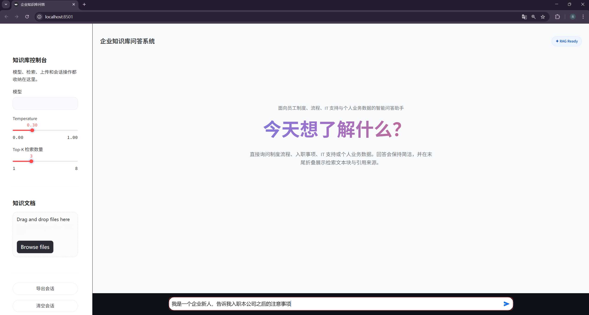
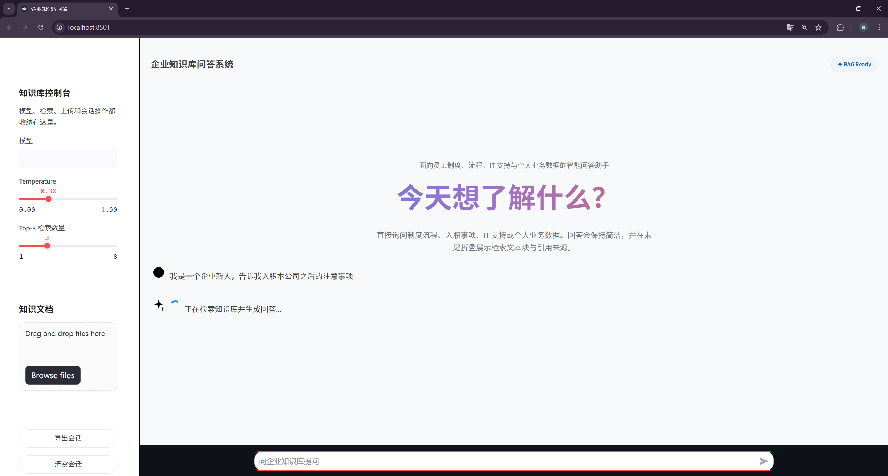
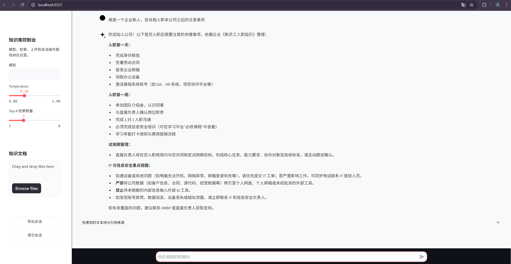
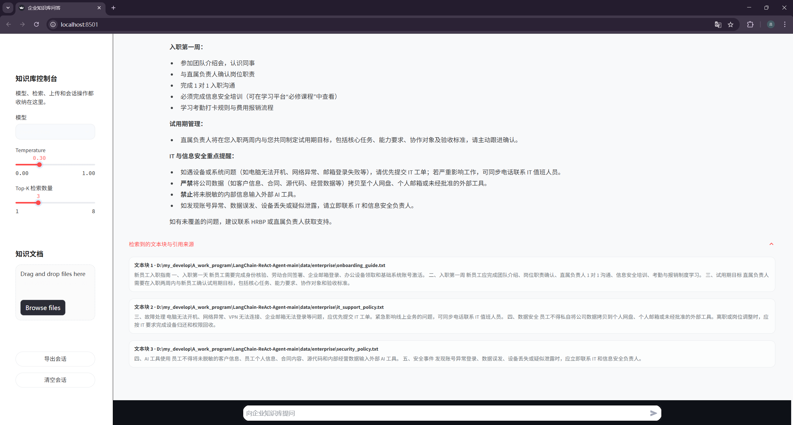

# 企业知识库 Agent 助手

一个基于 LangChain ReAct Agent、Chroma 和 Streamlit 的企业内部知识库助手示例项目。项目面向 AI 应用开发学习与简历展示，支持企业制度问答、员工模拟数据查询和个人周报生成。

## 项目能力

- 企业知识库问答：基于 HR、财务、IT、项目协作、信息安全等制度文档进行 RAG 检索增强回答。
- ReAct Agent 工具调用：Agent 可根据用户问题自动选择知识库检索、员工 ID 查询、部门查询、员工记录查询等工具。
- 员工模拟数据查询：支持查询年假余额、报销状态、项目进展、入职待办和周报上下文。
- 周报生成：按固定工具流程获取员工信息和项目记录，生成结构化中文周报。
- Streamlit 对话界面：提供流式聊天体验和示例问题入口。

## 技术栈

- LangChain / LangChain Core / LangChain Community
- ReAct Agent / AgentExecutor
- Chroma 向量数据库
- DashScope ChatTongyi 与 DashScope Embeddings
- Streamlit
- YAML 配置管理

## 项目结构

```text
.
├── app.py                         # Streamlit 应用入口
├── agent/
│   ├── react_agent.py             # ReAct Agent 创建与执行逻辑
│   └── tools/agent_tools.py       # 企业场景工具函数
├── rag/
│   ├── vector_store.py            # 文档入库、切分、向量存储、retriever 创建
│   └── rag_service.py             # RAG 检索与总结链
├── model/factory.py               # DashScope 聊天模型与 Embedding 模型初始化
├── prompts/
│   ├── main_prompt.txt            # Agent 主 Prompt
│   ├── rag_summarize.txt          # RAG 总结 Prompt
│   └── report_prompt.txt          # 报告生成 Prompt
├── config/
│   ├── agent.yml                  # 员工模拟数据路径
│   ├── chroma.yml                 # Chroma 与知识库配置
│   ├── prompts.yml                # Prompt 路径配置
│   └── rag.yml                    # 模型名称配置
├── data/enterprise/               # 企业制度知识库文档
└── data/enterprise_external/      # 员工模拟结构化数据
```

## 工作流程

1. 用户在 Streamlit 页面输入问题。
2. `ReactAgent` 根据问题判断是否需要调用工具。
3. 制度类问题调用 `rag_summarize`，从 Chroma 检索企业知识库资料。
4. 个人数据类问题调用 `get_employee_id` 和 `fetch_employee_records` 查询模拟员工数据。
5. 周报类问题按固定流程获取员工 ID、部门、项目记录，再生成结构化周报。
6. 最终回答以流式方式返回到前端。

## 快速开始

安装依赖：

```powershell
pip install -r requirements.txt
```

配置 DashScope API Key：

```powershell
$env:DASHSCOPE_API_KEY="your-api-key"
```

构建或更新企业知识库：

```powershell
python -m rag.vector_store
```

启动应用：

```powershell
streamlit run app.py
```

## 运行效果展示









## 示例问题

```text
差旅报销需要哪些材料？
我还有多少年假？
新员工入职第一周应该完成哪些事项？
根据我的本周项目记录生成周报。
VPN 无法连接应该怎么处理？
公司对外部 AI 工具使用有什么安全要求？
```

## 简历描述参考

基于 LangChain + ReAct Agent + Chroma 构建企业知识库智能助手，支持企业制度问答、员工数据查询和自动周报生成。系统通过 RAG 检索内部制度文档，结合 ReAct Agent 动态调用员工信息、报销记录、请假余额等工具，并使用 Streamlit 实现流式对话体验。

项目亮点：

- 构建企业知识库 RAG 流程，支持 TXT/PDF 文档切分、向量化入库、top-k 检索和基于上下文的回答生成。
- 基于 ReAct Agent 注册多类业务工具，实现制度问答、员工信息查询、周报生成等多任务自动调度。
- 使用 YAML 管理模型、Prompt、向量库和业务数据路径，提高项目可配置性和可迁移性。
- 通过模拟企业数据集实现“知识库 + 结构化数据”的混合问答，增强项目业务完整度。

## 注意事项

本项目使用模拟企业制度和模拟员工数据，不接入真实公司系统。用于学习、演示和简历项目展示时，请勿放入真实员工隐私、客户信息、合同、源代码或其他敏感数据。
